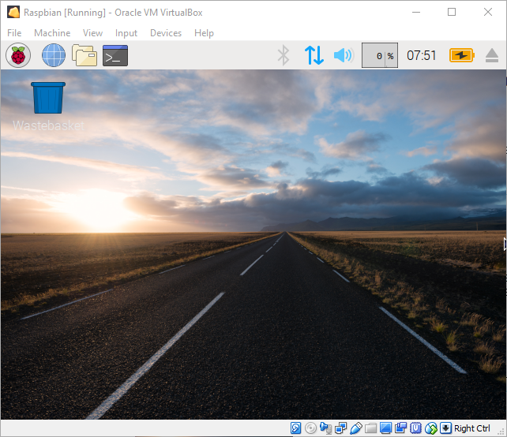

## Introduction

In this project you will create a Raspberry Pi Desktop Virtual Machine using VirtualBox.

### What you will make

A Raspberry Pi Desktop Virtual Machine which you can use to experiment.

### What you will learn

+ How to install Oracle VirtualBox
+ How to create a Virtual Machine
+ How to install a Linux operating system
+ How to use Virtual Machines, creating snapshots and sharing data

### Additional information for educators

If you need to print this project, please use the [printer-friendly version](https://projects.raspberrypi.org/en/projects/create-raspberry-pi-desktop-vm/print){:target="_blank"}.

Use the link in the footer to access the GitHub repository for this project, which contains all resources (including an example finished project) in the 'en/resources' folder.
