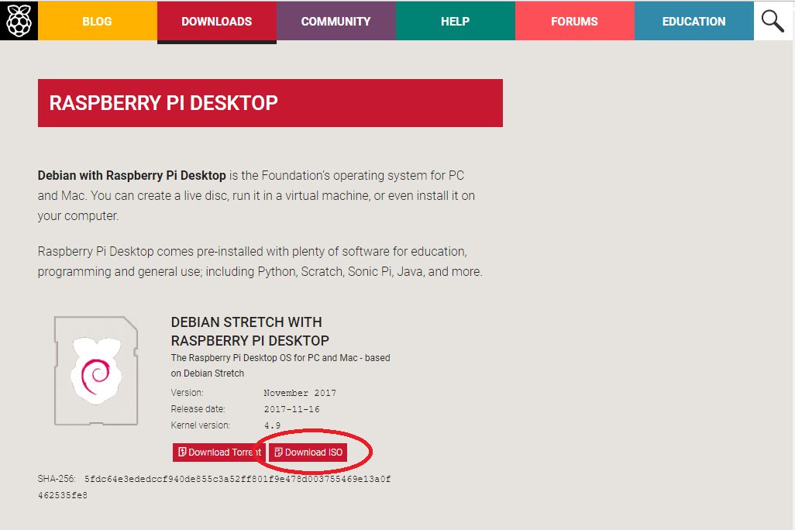

## Download Raspberry Pi Desktop install

The Raspberry Pi Desktop installation will need to be downloaded and stored on your computer.

+ Download the latest version of the [Raspberry Pi Desktop installation](https://www.raspberrypi.org/downloads/raspberry-pi-desktop/) from the Raspberry Pi website.

The download may take a long time as the file is large so using a high-speed connection is recommended.

*The latest version should be download and might be different to that shown in the image above.*

+ Save the .iso installation file on your computer, it doesnt matter where, but remember where you saved it as you will need it later.