## Install Oracle VM VirtualBox

The installation of Oracle VM VirtualBox will be depend on what operating system your computer uses:

--- collapse ---

---
title: Windows
---
 
### Download

+ Download the latest version of Virtual box by opening [www.virtualbox.org](https://virtualbox.org) and clicking the `Download VirtualBox` button.

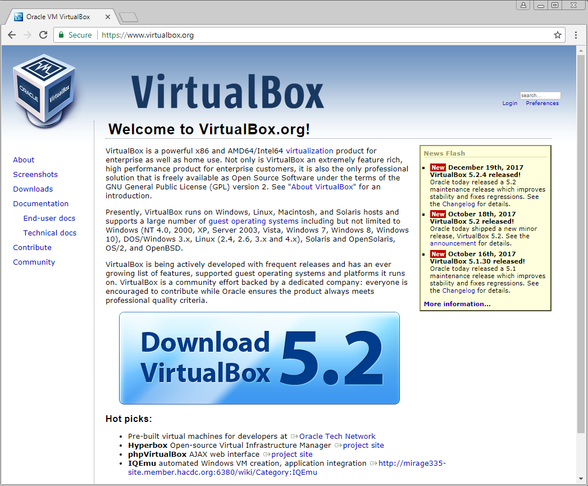

+ Under VirtualBox platform packages select `Windows hosts`.

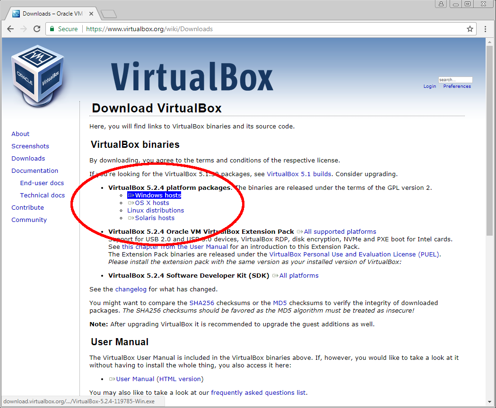

*The latest version should be download and might be different to that shown in the image above.*

The VirtualBox installation download will start.

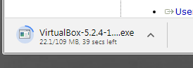

### Install

+ When the download has finished, run the VirtualBox installation program you downloaded, and click `Next`.

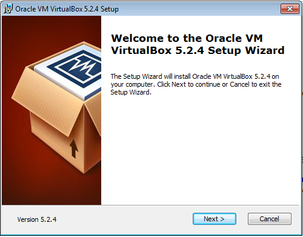

+ Confirm the VirtualBox component's you wish to install, this should be left as the default to install all components, and click `Next`.

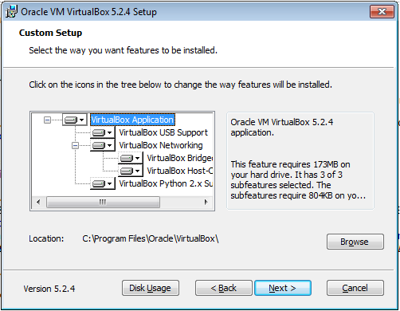

+ Confirm the explorer options and click `Next`.

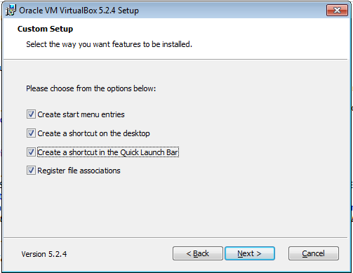

+ The VirtualBox installation will warn you that your network connection will be reset during the installation, if this is ok, click `Yes`.

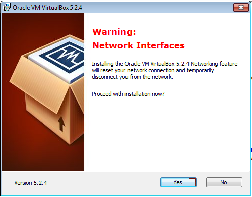

+ Confirm you are ready to install by clicking `Install`.

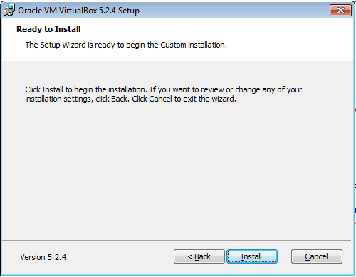

The installation program will run, you maybe asked to confirm that you are ok to install individual components and drivers.

+ When completed you will be notified and asked whether you wish to start Oracle VirtualBox after installation, click `Finish` to continue.

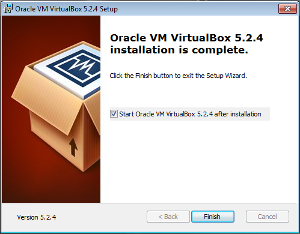
 
--- /collapse ---

--- collapse ---

---
title: Apple MacOS
---

### Download

+ Download the latest version of Virtual box by opening [www.virtualbox.org](https://virtualbox.org) and clicking the `Download VirtualBox` button.


+ Under VirtualBox platform packages select `OS X hosts`.


*The latest version should be download and might be different to that shown in the image above.*

The VirtualBox installation download will start.

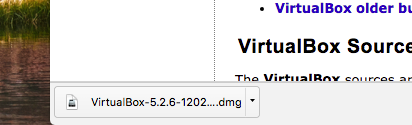

### Install

+ When the download has finished, run the VirtualBox installation program you downloaded, and double click the `VirtualBox.pkg` icon.

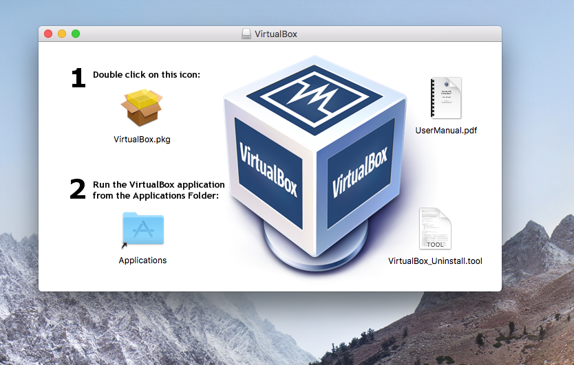

+ Click `Continue` to confirm you want to start the installation.

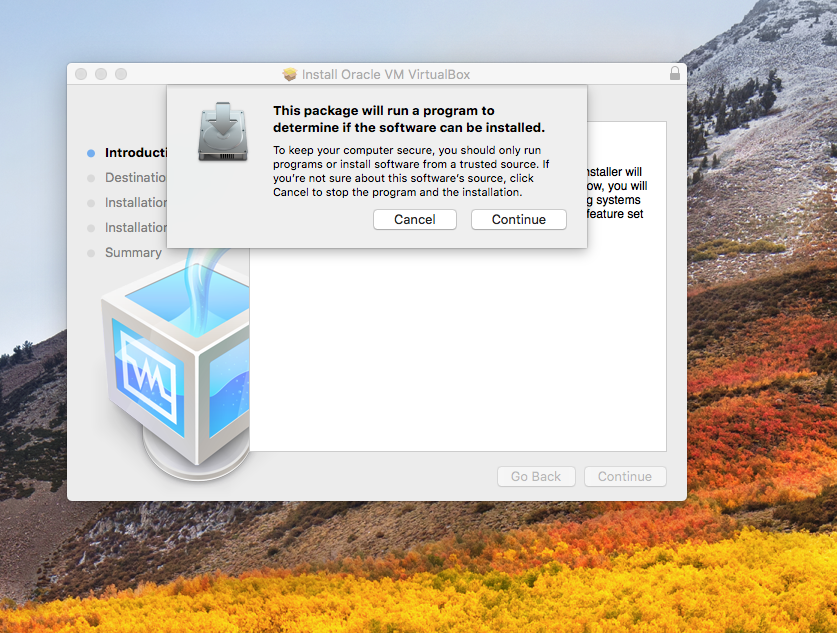 

The `Install Oracle VirtualBox VM VirtualBox` application will start.

+ Click `Continue` to start the installation

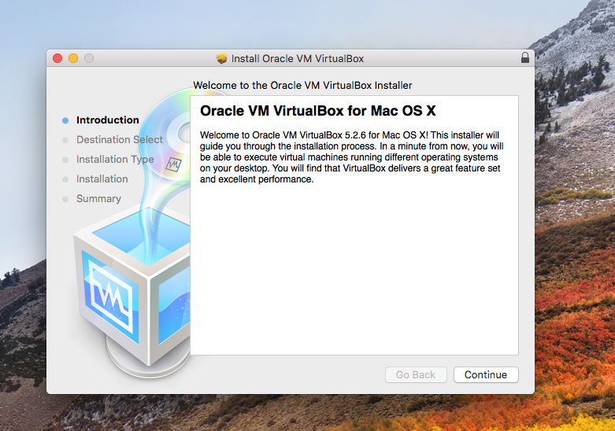

+ The installation will confirm the location and disk space requirements, click `Install` to continue.

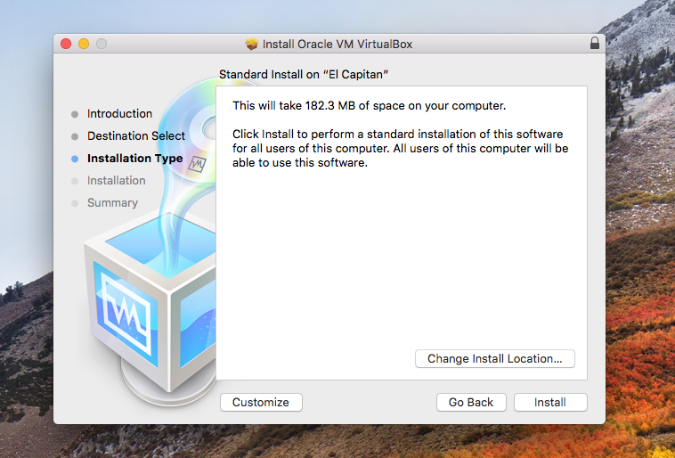

+ If prompted enter your User Name and Password to authorise the installation.

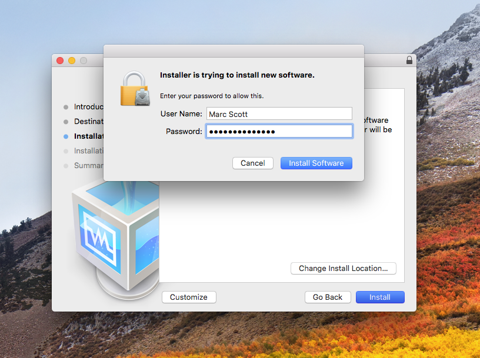

+ If you are informed that *Oracle is not a trusted publisher* you will need to open `Security & Privacy` settings and click `Allow` before restarting the install.

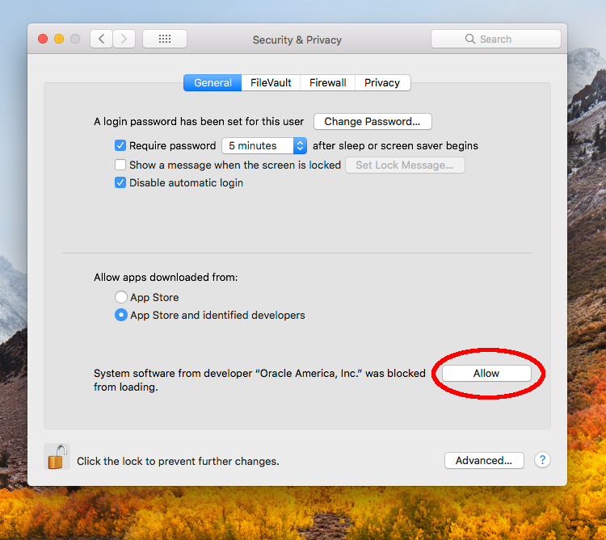

+ The installation will finish and you can click `Close` to finish.

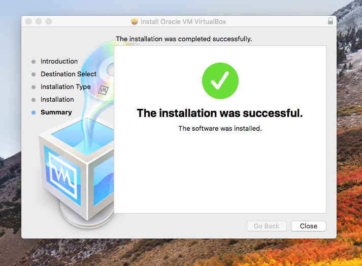

+ Once complete you can remove the Oracle VM VirtualBox installer by clicking `Move to Trash`.

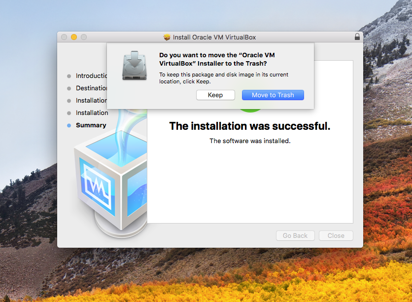

--- /collapse ---

--- collapse ---

---
title: Linux
---

### Install 

+ Open a terminal.

+ Use the following command to install Oracle VM VirtualBox using apt :

```bash
sudo apt-get install virtualbox
```

--- /collapse ---

