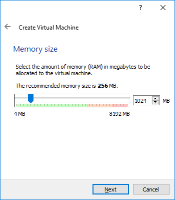

## Create a new Virtual Machine (VM)

+ Open `Oracle VM Virtual Box`

+ Click `New` to create a new Virtual Machine (VM)

+ Give the VM a name and setup the operating system VM:
    + The VM's `Name` can be anything you like
    + Type = `Linux`
    + Version = `Other Linux (32-bit)`

+ Set memory size to `1024 MB` and click `Next`.

+ Select `Create a virtual hard disk now` and click `Create`.

+ Set the hard disk file type to `VDI (VirtualBox Disk Image)` and click `Next`.

+ Set storage to `Dynamically allocated` and click `Next`.

+ Give the virtual hard disk a filename and size and click `Create`:
    + Its a good idea to name the hard disk the same as the VM
    + Set a hard disk size, `8.00 GB` is recommended

Oracle VirtualBox will now create your Virtual Machine ready for you to install the Raspberry Pi Desktop.