## Install Raspberry Pi Desktop

### Start your new Virtual Machine

+ Select your new VM in `Oracle VM VirtualBox Manager`.

+ Click Start.

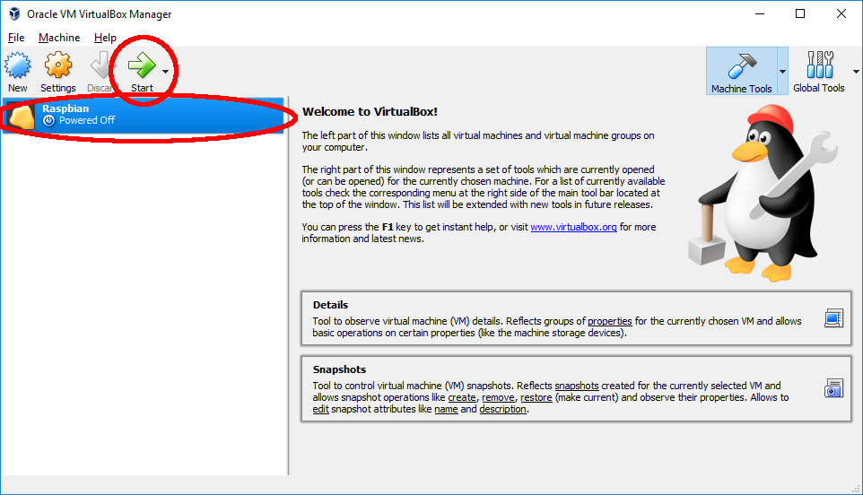

+ You will be prompted to select a start up disk, open the Raspberry Pi Desktop iso image you downloaded, by clicking on the folder icon and click `Start`

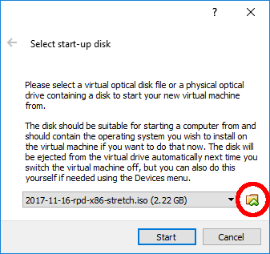

You VM will now start and the debian install will being.

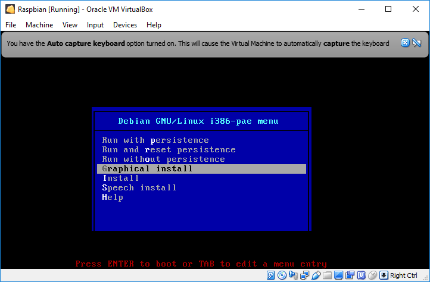

### Install Debian Linux

+ Select `Graphical install` from the Debian GNU/Linux menu.

*If you do not select 'Graphical install' quick enough the installer will start using the default option, if this happens, close the VirtualBox window and click `Start` to restart.*

+ Select your Keyboard type and click `Continue`.

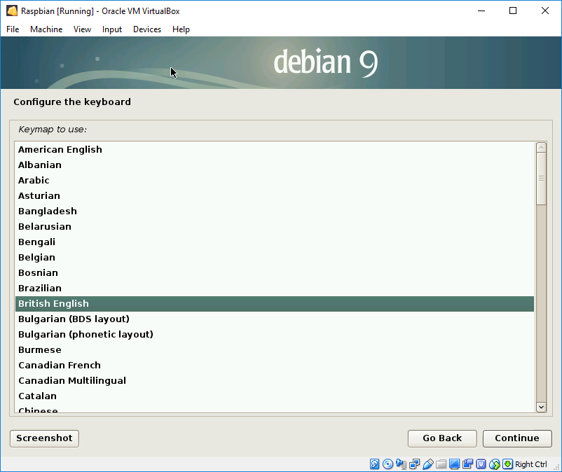

The installation process will now install media and detect what hardware is present.

+ Set how you want to Partition your hard disk, select `Guided - use entire disk` and click `Continue`.

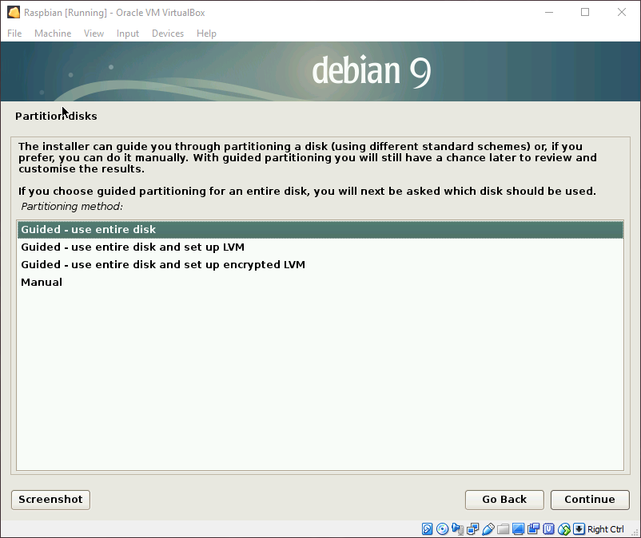

+ Select the disk to be partitioned, there will be only 1, and click `Continue`.

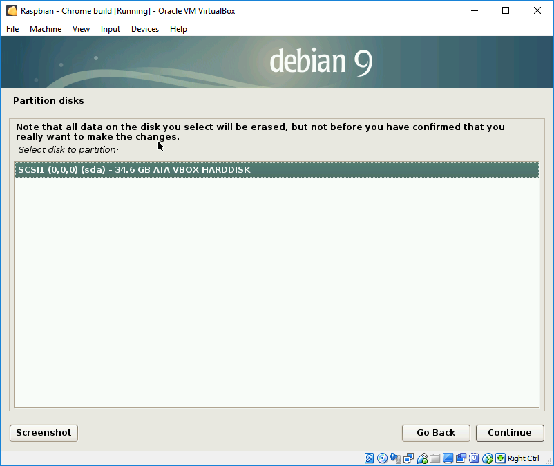

+ Set the partitioning scheme, select `All files in one partition (recommended for new users)` and click `Continue`.

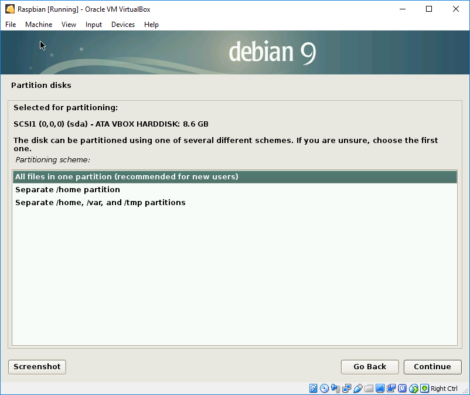

+ Confirm the partition settings by selecting `Finish partitioning and write changes to disk` and clicking `Continue`.

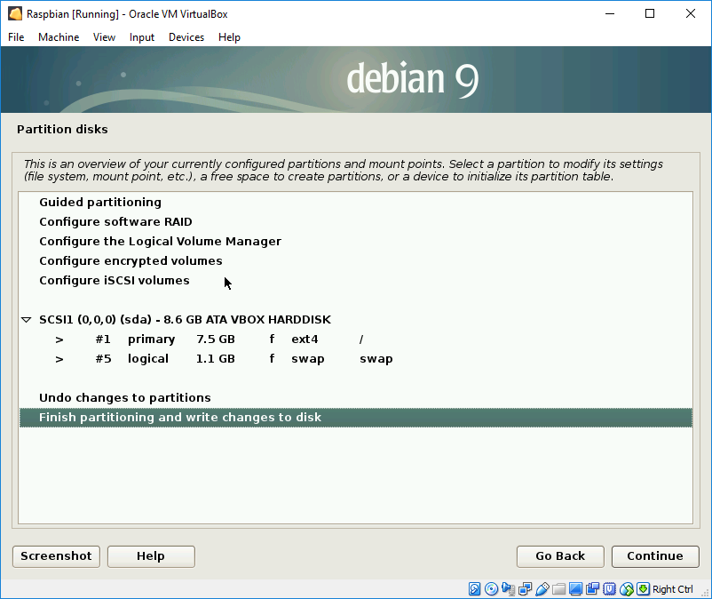

+ Confirm that you wish to write the changes to the disk by selecting `Yes` and clicking `Continue`.

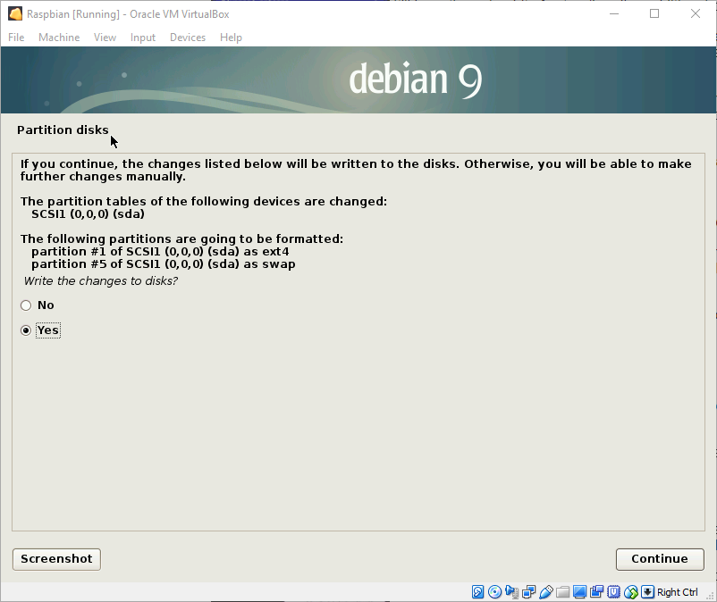

Debian will now install the operating system.

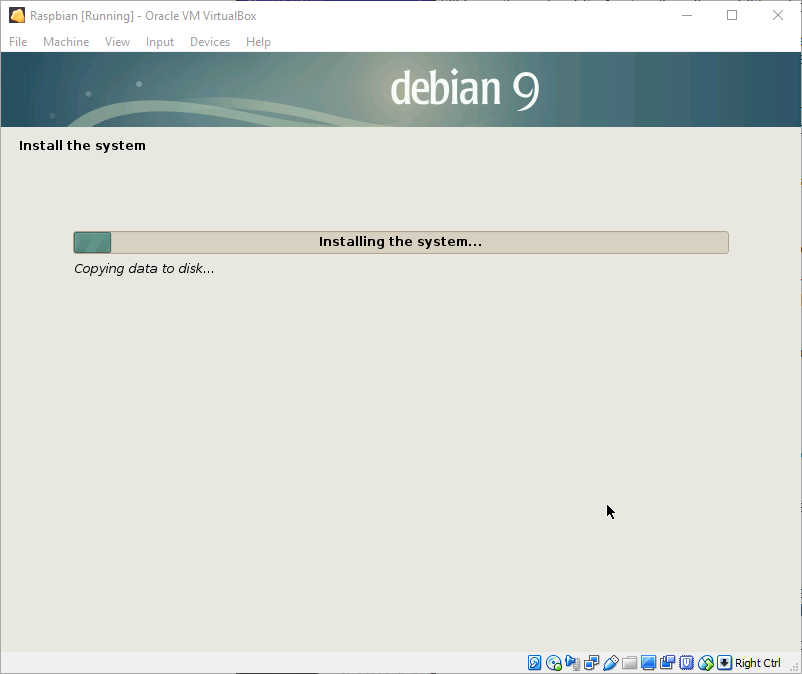

+ Confirm you want to install the GRUB boot loader on a hard disk by selecting Yes and clicking `Continue`.

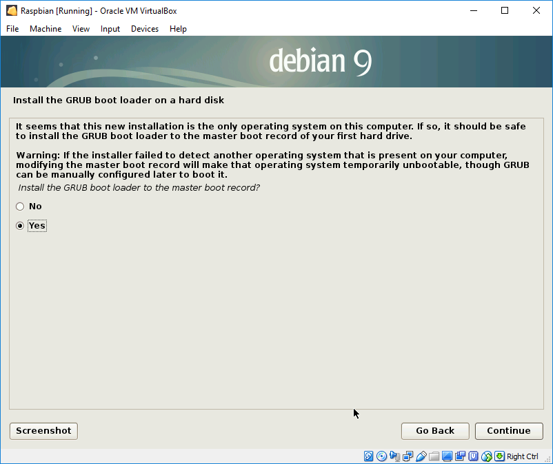

+ Select the device `/dev/sda` for boot loader installation and click `Continue`.

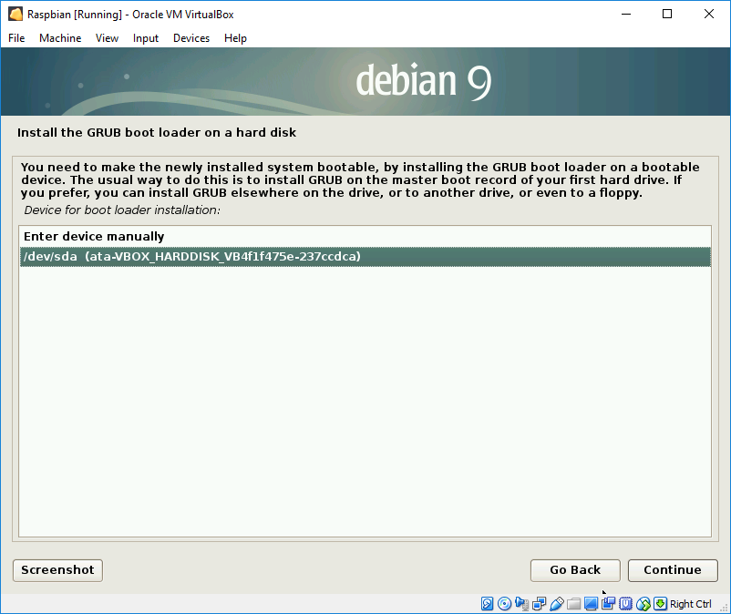

The installation will now carry on.

+ When installation has finished click `Continue`.

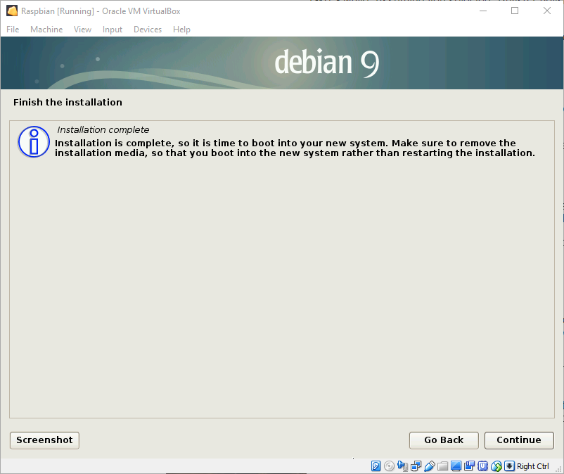

When installation completes the virtual machine will automatically reboot and you will be presented with the `GNU GRUB boot screen`

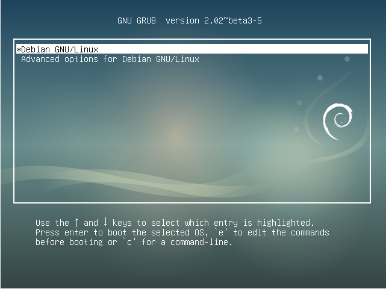