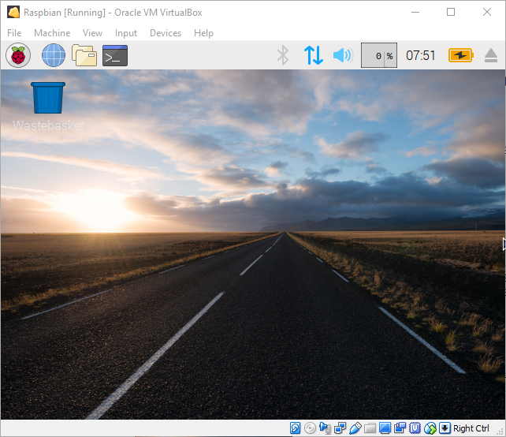

## Raspberry Pi Deskop Setup

When the Raspberry Pi Desktop VM boots you will be presented with the GNU GRUB boot loader.


+ Select `Debian GNU/Linux` and press Enter to boot Raspberry Pi Desktop.

The Raspberry Pi Desktop will boot in a small VirtualBox window.



### Install VirtualBox Guest Additions

Guest additions will make using your Raspberry Pi Desktop VM much easier by automatically resizing the screen size, enabling copying and pasting between your computer and the VM and sharing folders.

+ Select `Devices` from the VirtualBox menu and then click `Insert Guest Additions CD Image`.


+ Raspbian will confirm that `Removable medium was inserted`, click `Cancel`.


+ Open a Terminal by clicking the Rasperry Pi Desktop menu and selecting `Accessories`, `Terminal`.


+ Run the guest additions installation program:

```bash
sudo sh /media/cdrom/VBoxLinuxAdditions.run
```


The installation will run and when finished display the message `VirtualBox Guest Additions: Starting` when complete.


+ When completed reboot your Raspberry Pi Desktop by clicking the menu, selecting `Shutdown` and clicking `Reboot`.
