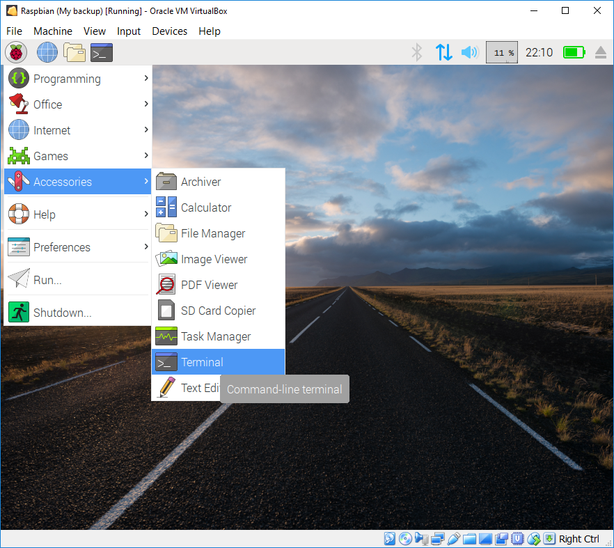

## Using your Virtual Machine

VirtualBox has lots of useful features, some of the more commonly used ones are detailed below, but if you want to learn more about VirtualBox have a look at the [HOWTOs and Tutorials](https://www.virtualbox.org/wiki/User_HOWTOS).

### Starting up

+ To start your VM, select it from the `Oracle VM VirtualBox Manager` and click `Start`.


### Shutting down

When you shutdown your VM, you have the option to shutdown Raspbian *normally* or closing it and saving its *state*, meaning the next time Raspbian is started it will start in exactly the same state as it was when it was closed with all you applications still open.

+ To shutdown *normally* open the Raspbian Menu and click Shutdown.


+ To save state, close the VM window (by click the X), select `Save the machine state` and click `OK`.


The `Send the shutdown signal` option will ask Raspbian to shutdown *normally* and `Power off the machine` will simply *turn it off*.

### Screen resizing & Full-screen

If you have installed the `VirtualBox Guest Additions`, the Raspbian screen will automatically resize to the size of the window when you expand or shrink it.

+ Full-screen mode can be enabled by selecting `View` on the VirtualBox menu and clicking `Full-screen Mode`.


When you enter full-screen mode the VirtualBox menu will disappear and be replaced by a pop out menu at the bottom of the screen.


+ Hover the mouse pointer over the pop out menu to make it appear.


+ Select `View` and click `Full-screen Mode` to return to a windowed view.

### Shared Clipboard

If you have installed the `VirtualBox Guest Additions`, you will be able to share your clipboard across your Computer and your VM - this means that you will be able to copy and paste between your computer and your VM and vice versa.

+ To enable Shared Clipboard, select `Devices`, `Shared Clipboard` and click `Bidirection`.


You can also set VirtualBox to only share the clipboard in one direction either `Host` (your computer) `to Guest` (VM) or `Guest to Host`.

### Sharing folders

It is often useful to share folders between your computer and your VM, you can do this by creating a shared folder on your computer which your computer and your VM will both be able to read and write too.

To setup a shared folder:

+ From the Virtual Machine menu select `Devices`, `Shared Folders` and click `Shared Folder Settings`.


+ Click the `add new shared folder` icon


+ Select the folder from your computer that you wish to share. You can browse for the folder by opening the `Folder Path` dropdown and clicking `Other`.


+ Give your shared folder a name that you will remember, for example `MyShare`.

+ Select `Auto-mount` and `Make-Permenant`, you also have the option to make the folder `Read-only` and click OK.

 

+ Click OK on the Shared Folder settings window to save your shared folder.

You will need to create a folder on your Raspbian VM which will connect to the shared folder on your computer and mount it:

+ Open a terminal in Raspbian using the menu and selecting `Accessories` and then clicking `Terminal`. 



+ Create a directory in Raspbian which your shared folder will connect too:

```bash
cd ~
mkdir LinkToMyShare
```

+ Mount the shared folder, passing the name of your shared folder and the path to the directory you created:

```bash
sudo mount -t vboxsf MyShare /home/pi/LinkToMyShare
```

You can now share files between your computer and VM.


### Snapshots

One of the advantages of using VM's is that they are really easy to backup and restore. You can take backups or `Snapshots` at any point, which will restore your VM to exactly the state it was when the backup was taken. This is really useful if you are going to be making a lot of changes to your VM which may want to undo.

To take a snapshot:

+ From the `Machine Tools` menu, select `Snapshots`.


+ Click `Take` on the menu


+ Enter a name for your Snapshot, and click `OK`.


To restore a snapshot:

+ Select the snapshot you wish to restore from the `Snapshots` window and click `Restore`


+ VirtualBox will ask you to confirm and also give you the option of taking a snapshot of the current state before restoring, click `Restore` to continue. 


The snapshot will now restore and your VM will start up in the same state as when it was taken.